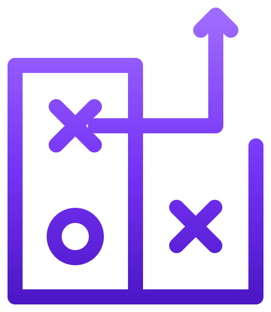

<p align="center">
  
</p>

<h1 align="center">Playbook</h1>

<p align="center">
  Local-first desktop app for tagging, cutting and reviewing rugby match footage of rival teams.
</p>

<p align="center">
  <em>Electron · React · TypeScript · Tailwind · ffmpeg</em>
</p>

---

## What it is

Playbook is a desktop tool for rugby coaches and analysts who scout opposing teams. You import a match video, tag plays as you watch, attach annotations and frame snapshots, then cut and export clip reels per opponent or per player.

Everything stays on your machine. No accounts, no cloud, no telemetry. Your match footage and notes live as plain files in a folder you choose.

## Why local-first

Match footage is often shared under restrictive terms (clubs, leagues, broadcasters). Uploading it to a SaaS analytics platform is frequently a non-starter. Playbook treats your filesystem as the database:

- Pick a "platform folder" once during onboarding.
- Every opponent, match, clip and annotation is a JSON file (or a video / PNG) in that folder.
- Back it up however you back up files (Time Machine, an external drive, a synced folder).
- Inspect, migrate, or move data with regular tools — no proprietary export.

## Features

- **Opponents & matches** — organise footage by rival team and individual fixture.
- **Tagging** — punch in/out timestamps with custom tag sets per match (defaults included).
- **Clips** — every tagged moment becomes a clip with metadata (players involved, notes, star rating).
- **Annotations** — pause on a frame, draw/note on it, save the snapshot alongside the clip.
- **Player reports** — per-player view aggregating their actions across a match.
- **Opponent notes** — global scouting notes per rival team.
- **Cuts & exports** — ffmpeg-powered clip extraction and concat for sharing reels.

## How it works

```
Renderer (React + Zustand)
   │ window.api.<domain>.<method>(...)
   ▼
preload (contextBridge)        ← only API surface exposed to the renderer
   │ ipcRenderer.invoke
   ▼
main / ipc handlers            ← thin, return { ok, data } | { ok, error }
   │
   ▼
@playbook/business-logic       ← framework-free use cases + Zod entities
   │
   ▼
@playbook/file-system          ← repositories that read/write JSON to disk
   │
   ▼
<platformFolder>/<opponent>/<match>/...
```

This is a strict three-process Electron setup:

- **Renderer** has no Node access. It can't read files, spawn processes, or import `electron`. It talks to main only through a typed `window.api` exposed by the preload script.
- **Preload** runs in an isolated world, exposes a small typed surface via `contextBridge`, and forwards calls to main with `ipcRenderer.invoke`.
- **Main** owns the filesystem, ffmpeg, native dialogs, and the BrowserWindow. Each IPC handler is a thin wrapper around a use case.

The renderer/main boundary is enforced by tsconfig and ESLint-style imports — `fs`, `path`, `electron` are forbidden in renderer code.

### On-disk layout

```
<platformFolder>/
└── <opponentSlug>/
    ├── opponent.json                   ← OpponentEntity
    └── <matchSlug>/
        ├── match.json                  ← MatchEntity
        ├── video.<ext>                 ← imported source (copied or referenced)
        ├── tags.json                   ← custom tag set for this match
        ├── players.json                ← roster
        ├── clips/
        │   └── <uuid>.json             ← ClipEntity
        └── annotations/
            ├── <uuid>.json             ← AnnotationEntity
            └── <uuid>.png              ← frame snapshot
```

Writes are atomic (write-to-temp + rename) so a crash mid-save can't corrupt a JSON file. Every entity is validated with [Zod](https://zod.dev) on read and write.

## Tech stack

| Layer | Choice |
|---|---|
| Shell | Electron 33 via `electron-vite`, packaged with `electron-builder` |
| UI | React 19, TypeScript 5, Tailwind CSS 4, shadcn/ui (base-nova), Lucide icons |
| State | Zustand in the renderer |
| Routing | `react-router-dom` (HashRouter — no server) |
| Validation | Zod schemas per entity |
| Video | HTML5 `<video>` for playback; `ffmpeg-static` + `fluent-ffmpeg` in main for cut/concat/thumbnails |
| Build | Turborepo + pnpm workspaces |

## Repository layout

```
apps/
└── desktop/                 ← the Electron app (main, preload, renderer)
packages/
├── ui/                      ← shadcn/ui re-exports + theme tokens
├── business-logic/          ← entities (Zod) + use cases, framework-free
└── file-system/             ← repositories, paths, slug rules, atomic writes
```

The split is deliberate: `business-logic` and `file-system` have no React, no Electron, no DOM. They're plain TypeScript and could be reused from a CLI or a different shell.

## Getting started (users)

> The app is currently built and tested on **macOS Apple Silicon**. Other platforms work in dev but aren't packaged yet.

1. Grab the latest `Playbook-<version>-arm64.dmg` from the [Releases](https://github.com/DiegoPinochet/playbook/releases) page.
2. Open the dmg and drag **Playbook** into Applications.
3. First launch: right-click the app and choose **Open**. The build is unsigned, so macOS Gatekeeper will warn once and then remember the choice.
4. On first run, pick a platform folder. That's where all your data will live.

## Getting started (developers)

Pre-requisites: **Node 20+** and **pnpm 10+**.

```bash
pnpm install
pnpm dev          # launches the Electron window with HMR
pnpm lint         # tsc --noEmit across all packages
pnpm build        # type-check + build all packages and the desktop app
pnpm dist         # build a local dmg without publishing (output in apps/desktop/release/)
```

### Project conventions

- Files: `kebab-case.ts`. Suffixes: `.entity.ts`, `.use-case.ts`, `.repository.ts`, `.ipc.ts`, `.store.ts`.
- Pages live at `apps/desktop/src/renderer/app/<route>/page.tsx`. Route-private components go in `_components/`, stores in `_stores/`, hooks in `_hooks/`.
- UI components are always imported from `@playbook/ui`, never from local files inside the desktop app.
- Use cases throw on invalid input. IPC handlers wrap with a `handle()` helper and return `{ ok: true, data } | { ok: false, error }`. The renderer surfaces errors with toasts.
- Deletes are real — the user owns the filesystem.

### Adding a feature

A new feature typically touches four layers in order:

1. **Entity** in `packages/business-logic/src/<domain>/<entity>.entity.ts` — Zod schema + inferred type.
2. **Use case** in `packages/business-logic/src/<domain>/use-cases/` — pure function, takes a repository, throws on bad input.
3. **Repository method** in `packages/file-system/src/repositories/<domain>.repository.ts` — the only place that touches `fs`.
4. **IPC handler** in `apps/desktop/src/main/ipc/<domain>.ipc.ts` + a typed entry in `apps/desktop/src/preload/api.d.ts` so the renderer can call it via `window.api`.

Then build the UI on top of `window.api` from a Zustand store or a route page.

## Security model

- The renderer runs with `contextIsolation: true`, `nodeIntegration: false`, and `sandbox: true`. It cannot touch the filesystem or spawn processes directly.
- The only renderer↔main surface is the typed `window.api` defined in `preload`. Each method maps to a single IPC channel and a single use case.
- Repositories validate every JSON file with Zod before returning it, so a hand-edited or corrupted file fails loudly instead of poisoning state.
- The app makes no outbound network requests at runtime.

## Contributing

Issues and PRs are welcome. Please:

1. Open an issue first for non-trivial changes so we can agree on direction.
2. Follow the layering above (renderer never imports `fs`, business logic stays framework-free).
3. Run `pnpm lint` before pushing — it's the same check the pre-commit hook runs.
4. Use [gitmoji](https://gitmoji.dev) prefixes in commit messages, as the existing history does (`✨` feature, `🐛` fix, `♻️` refactor, `🔖` release, `📝` docs, ...).

## License

Released under the [MIT License](LICENSE).
